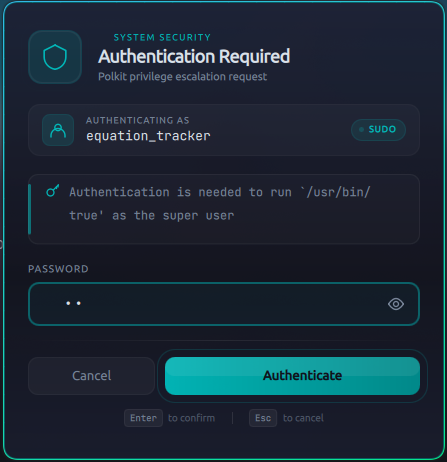

# fusion-polkit

A polkit authentication agent for Hyprland with a Catppuccin Mocha themed UI. Forked from [quillpolkit](soyeb-jim285/quillpolkit) which originally derived from [hyprpolkitagent](https://github.com/hyprwm/hyprpolkitagent).



## Security Improvements

- Securely wipes authentication credentials from memory after use.
- Added rate limiting for authentication attempts (5 attempts per minute).
- Automatically aborts authentication sessions after repeated failures.
- Reduced credential exposure during logging and state handling.
- Added thread synchronization around authentication state changes to improve robustness.

## Features

- Stunning UI with gradients and animations
- Spacious layout
- Glassmorphism effect
- Lock icon and profile icon
- Beautiful fonts

## Install

```bash
git clone https://github.com/Equation-Tracker/fusion-polkit.git
cd fusion-polkit
chmod +x install.sh
./install.sh

# Enable service
systemctl --user enable --now fusion-polkitagent
```

The install script builds the binary, copies it to `/usr/local/bin/fusion-polkitagent`, and sets up a systemd user service.

## Dependencies

- Qt6 (Widgets, Quick, QuickControls2)
- hyprutils
- polkit, polkit-qt6
- CMake, C++23 compiler
