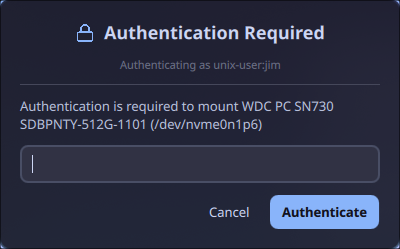

# quillpolkit

A polkit authentication agent for Hyprland with a Catppuccin Mocha themed UI. Fork of [hyprpolkitagent](https://github.com/hyprwm/hyprpolkitagent).



## Features

- Catppuccin Mocha color scheme
- Compact layout with no wasted space
- Semi-transparent background with blur support
- Lock icon and shake animation on wrong password
- System font (Noto Sans)

## Install

```bash
git clone https://github.com/soyeb-jim285/quillpolkit.git
cd quillpolkit
bash install.sh
```

The install script builds the binary, copies it to `/usr/local/bin/quill-polkit-agent`, and sets up a systemd user service.

## Dependencies

- Qt6 (Widgets, Quick, QuickControls2)
- hyprutils
- polkit, polkit-qt6
- CMake, C++23 compiler

## Hyprland config

Add to your `hyprland.conf` for floating + blur:

```ini
windowrule {
    match:class = hyprpolkitagent
    float = true
    center = true
}
```
